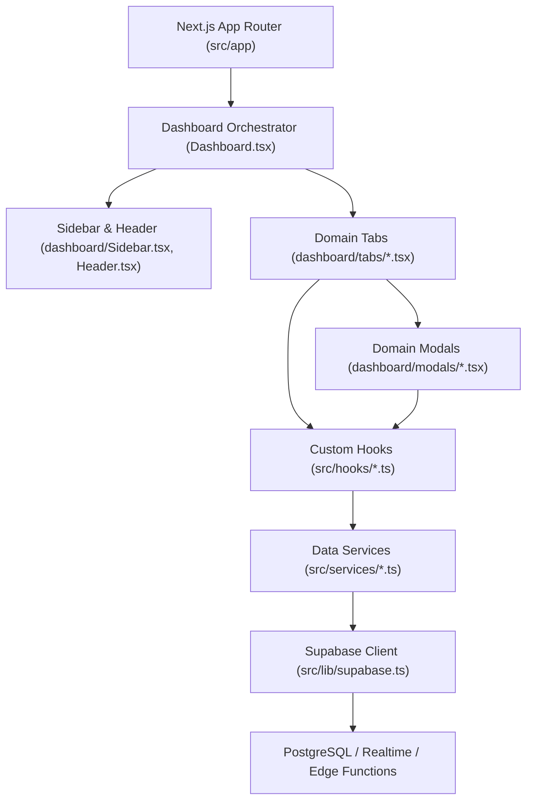

# 🏛️ Arquitetura do Sistema (SigaPanelAdmin)

Este documento detalha os padrões arquiteturais, a separação de responsabilidades e as convenções estruturais adotadas no projeto **SigaPanelAdmin**. Todos os agentes e desenvolvedores devem seguir estritamente este modelo ao criar novas rotas, abas, modais, hooks ou serviços.

---

## 1. Stack Tecnológica Principal

* **Framework Web:** [Next.js 15](https://nextjs.org/) (App Router + React Server / Client Components).
* **Biblioteca de UI:** [React 19](https://react.dev/) (Hooks avançados, concorrência e gerenciamento de estado otimizado).
* **Linguagem:** [TypeScript](https://www.typescriptlang.org/) (tipagem estrita com contratos do Supabase).
* **Backend & Banco de Dados:** [Supabase](https://supabase.com/) (PostgreSQL, Auth, Realtime, Storage e Edge Functions).
* **Armazenamento de Mídia:** Cloudflare R2 / Supabase Storage.
* **Estilização:** CSS Vanilla com Design System próprio centralizado em `src/index.css` (evitar TailwindCSS).
* **Ícones:** [lucide-react](https://lucide.dev/).

---

## 2. Mapa Estrutural do Repositório

```text
SigaPanelAdmin/
├── .agents/                    # Customizações de agentes e Skills do projeto
│   └── skills/                 # Skills especializadas (architecture, design-system, clean-code, etc.)
├── scripts/                    # Scripts de suporte e infraestrutura local
│   └── switch-env.mjs          # Gerenciador de alternância entre Dev e Prod
├── src/
│   ├── app/                    # Next.js App Router (Rotas de página e API Routes)
│   │   ├── api/                # API Endpoints (server-side, envio de e-mails, exclusão de conta)
│   │   ├── delete-account/     # Rota pública de conformidade de exclusão de conta
│   │   ├── login/              # Rota de autenticação de administradores
│   │   ├── terms/              # Termos de uso e políticas de privacidade
│   │   ├── layout.tsx          # Root Layout com carregamento de fontes e estilos globais
│   │   ├── page.tsx            # Ponto de entrada (redireciona para login ou monta Dashboard)
│   │   └── middleware.ts       # Proteção de rotas e verificação de sessão admin
│   ├── assets/                 # Imagens estáticas, logotipos e ilustrações
│   ├── components/             # Componentes de apresentação visual
│   │   ├── Dashboard.tsx       # Orquestrador mestre do painel administrativo
│   │   ├── Login.tsx           # Formulário e tela de login administrativo
│   │   ├── dashboard/          # Subcomponentes estruturais do painel
│   │   │   ├── Header.tsx      # Barra de cabeçalho com título dinâmico da aba ativa
│   │   │   ├── Sidebar.tsx     # Menu lateral fixo com contadores de badge e navegação
│   │   │   ├── modals/         # Modais de domínio (RejectionDetail, WorkDetail, etc.)
│   │   │   ├── tabs/           # Abas modulares independentes (Overview, Users, Moderação, etc.)
│   │   │   └── utils.ts        # Formatadores de data, cálculo de prazos e valores de anúncios
│   │   └── users/              # Componentes especializados para gestão de usuários
│   ├── hooks/                  # Custom Hooks (camada de estado, orquestração e Realtime)
│   ├── lib/                    # Instâncias de clientes (Supabase client-side e server-side)
│   ├── services/               # Camada de acesso a dados (Supabase queries, R2, notificações)
│   ├── types/                  # Definições de tipos e esquemas gerados do banco de dados
│   └── index.css               # Design System global em CSS puro
├── .env.development            # Variáveis do banco de Desenvolvimento
├── .env.production             # Variáveis do banco de Produção
├── .env.local                  # Apontamento ativo (gerado por switch-env.mjs)
└── package.json
```

---

## 3. Divisão de Responsabilidades em Camadas (Layered Pattern)

A aplicação segue uma hierarquia de responsabilidades clara e unidirecional:



### 3.1 Camada de Apresentação (`src/components/dashboard/tabs/`)
* Cada tela ou sub-área do painel possui um arquivo próprio em `tabs/` (ex: `OverviewTab.tsx`, `ModerationRejectionsTab.tsx`, `UsersTab.tsx`, `StoresTab.tsx`).
* **Regra:** As abas **não** devem executar chamadas diretas ao `supabase.from()`. Elas consomem os hooks dedicados (`useModerationRejections`, `useUsers`, `useWorksModeration`, etc.) ou recebem funções de callback do orquestrador.
* Cada aba gerencia apenas a UI local, filtros de tela, paginação e gatilhos para abertura de modais.

### 3.2 Camada de Estado & Tempo Real (`src/hooks/`)
* Encapsulam a lógica reativa de cada domínio:
  * Estados de carregamento (`loading`), erro (`errorState`), paginação e filtros.
  * Inscrições em canais **Supabase Realtime** (`supabase.channel(...)`).
  * Notificações visuais através do hook `useToast()`.
  * Cálculos de agregações ou métricas (KPIs) usando `useMemo`.
* **Regra:** Sempre limpar os canais Realtime no return do `useEffect`:
  ```typescript
  return () => {
    supabase.removeChannel(channel);
  };
  ```

### 3.3 Camada de Serviços de Dados (`src/services/`)
* Objetos utilitários puros contendo funções assíncronas (ex: `moderationService.ts`, `usersService.ts`, `notificationsService.ts`).
* Responsáveis exclusivamente por:
  * Executar queries com `supabase.from('...').select()`, `.insert()`, `.update()`.
  * Tratamento e normalização dos dados brutos retornados pelo PostgreSQL.
  * Chamadas para Edge Functions e serviços externos (Amazon Rekognition, Comprehend, Cloudflare).
* **Regra:** Serviços **não** utilizam estado React (`useState`), toasts ou hooks. Eles apenas lançam exceções ou retornam payloads tipados.

### 3.4 Camada de Tipagem (`src/types/`)
* `database.types.ts`: Contrato de tabelas, linhas, inserções e atualizações gerado do Supabase.
* Tipos de domínio adicionais (ex: `works.types.ts`) complementam modelos que envolvem regras de negócio ou enriquecimento de dados.

---

## 4. O Padrão de Abas e Modais

### 4.1 Tipagem Unificada de Abas (`DashboardTab`)
Todas as abas do painel são declaradas no enum/type `DashboardTab` dentro de `src/components/dashboard/Sidebar.tsx`:
```typescript
export type DashboardTab =
  | 'overview'
  | 'selo'
  | 'users'
  | 'works'
  | 'stories'
  | 'reports'
  | 'settings'
  | 'banners'
  | 'moderation'               // Solicitações ativas (pendentes/aprovadas)
  | 'moderation_rejections'    // Central de recusas para o gestor
  | 'financial'
  | 'stores';
```
Quando uma nova aba for adicionada:
1. Declarar o identificador em `DashboardTab` (`Sidebar.tsx`).
2. Adicionar o item de menu correspondente na navegação do `Sidebar.tsx`.
3. Adicionar o título legível no `Header.tsx`.
4. Renderizar o componente em `Dashboard.tsx` condicionado a `activeTab === 'sua_aba'`.

### 4.2 Localização de Modais
* Modais de domínio específico devem residir em `src/components/dashboard/modals/`.
* Devem ser fechados ao clicar no botão `X`, no botão "Fechar" ou no clique do overlay (com `e.stopPropagation()` no conteúdo interno).
* Devem possuir `zIndex` coerente (geralmente entre `1000` e `1200`) e limite de altura (`maxHeight: '90vh'`, `overflowY: 'auto'`).

---

## 5. Gestão de Ambientes Duplos (Dev vs Prod)

O projeto opera com isolamento rigoroso entre os ambientes de **Desenvolvimento** e **Produção**:
* O script `scripts/switch-env.mjs` é responsável por copiar o arquivo correspondente (`.env.development` ou `.env.production`) para `.env.local`.
* Comandos NPM padronizados:
  * `npm run env:dev`: Aponta o ambiente local para o banco de Desenvolvimento.
  * `npm run env:prod`: Aponta para Produção (com alerta interativo de segurança).
  * `npm run env:status`: Verifica qual banco de dados está ativo no `.env.local`.
  * `npm run dev`: Garante chaveamento para Dev e inicia o Next.js.
  * `npm run prod`: Garante chaveamento para Prod com aviso e inicia o Next.js.

---

## 6. Diretrizes Arquiteturais Inegociáveis

1. **Nunca misturar regras de negócio em arquivos de página (`app/`):** O diretório `app/` serve estritamente para roteamento e montagem de layouts.
2. **Nunca executar consultas diretas ao Supabase nos componentes de apresentação:** Utilize os serviços em `src/services/` e consuma através de hooks em `src/hooks/`.
3. **Respeitar o fluxo unidirecional:** Ações disparadas na UI chamam o hook -> o hook aciona o service -> o service executa no Supabase -> o Realtime ou o refetch atualiza o estado do hook -> a UI re-renderiza.
4. **Isolar Modais em arquivos dedicados:** Evitar declarar modais de centenas de linhas diretamente dentro de `Dashboard.tsx`.
