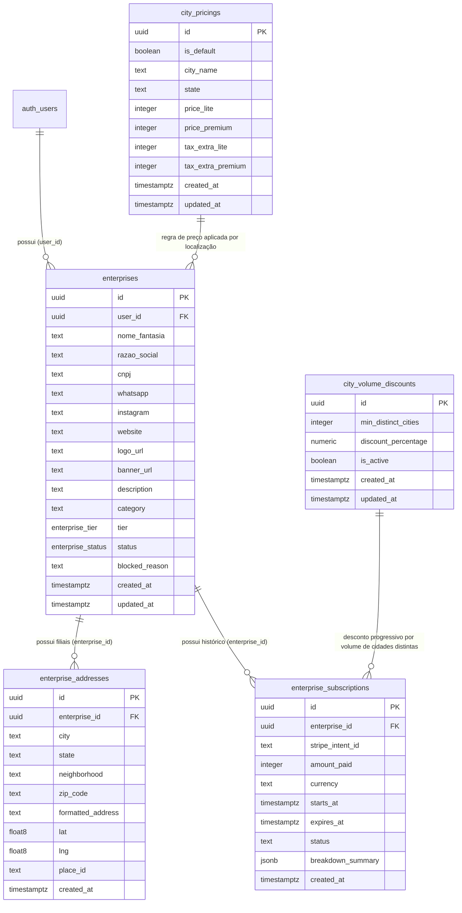

# Especificação Técnica: Banco de Dados (Supabase / PostgreSQL)
**Módulo:** Divulgação de Empresas / Lojas (Sprint 15)  
**Arquivo:** `01_database_schema.md`

---

## 1. Visão Geral do Schema

O módulo de Empresas (Divulgação Comercial) no Supabase é composto por 5 tabelas principais e 2 enums customizados. Ele gerencia desde os dados cadastrais do estabelecimento comercial (`enterprises`), múltiplos endereços por empresa (`enterprise_addresses`), histórico de assinaturas de pagamento no Stripe (`enterprise_subscriptions`), regras de desconto progressivo por volume de cidades distintas (`city_volume_discounts`) e a tabela de precificação regional e global (`city_pricings`) gerida pelo painel administrativo.

> [!NOTE]
> A nomenclatura foi padronizada para **`enterprise`** para evitar qualquer tipo de ambiguidade com os módulos de **`stories`** (`story_channels` / `story_items`).

### Diagrama de Relacionamento (ER)



---

## 2. Enums Customizados

### 2.1 `enterprise_tier`
Define o plano comercial de anúncio do estabelecimento.
* `'LITE'`: Plano básico. Card compacto no Feed, sem suporte a banner horizontal de topo.
* `'PREMIUM'`: Plano prioritário. Card estendido com banner promocional, borda de destaque, selo "Destaque" e prioridade no topo do Feed.

### 2.2 `enterprise_status`
Define o estado da máquina de ciclo de vida do anúncio na plataforma.
* `'DRAFT'`: Rascunho em criação pelo anunciante (cadastro incompleto ou não submetido ao pagamento).
* `'PENDING_PAYMENT'`: Formulário concluído, aguardando liquidação do pagamento no Stripe / Pix.
* `'ACTIVE'`: Pagamento confirmado. Anúncio visível publicamente no Feed por 365 dias.
* `'EXPIRED'`: Prazo de 365 dias vencido. Oculta do Feed público até que haja renovação.
* `'BLOCKED'`: Bloqueada manualmente pela moderação por infração técnica ou de termos de uso. Oculta do Feed público.

---

## 3. Especificação das Tabelas e Constraints de Integridade

### 3.1 `enterprises`
Armazena a entidade principal do anúncio comercial.

| Campo | Tipo | Nulidade | Default | Descrição |
| :--- | :--- | :--- | :--- | :--- |
| `id` | `uuid` | `NOT NULL` | `gen_random_uuid()` | Chave Primária |
| `user_id` | `uuid` | `NOT NULL` | - | FK para `auth.users(id)` (Proprietário do anúncio) |
| `nome_fantasia` | `text` | `NOT NULL` | - | Nome comercial exibido no Feed e no App |
| `razao_social` | `text` | `NULL` | - | Nome jurídico da empresa (Opcional) |
| `cnpj` | `text` | `NULL` | - | CNPJ formatado ou apenas dígitos (Opcional) |
| `whatsapp` | `text` | `NULL` | - | Número com DDD para deeplink (ex: `5511999998888`) |
| `instagram` | `text` | `NULL` | - | Username sem @ ou URL completa do perfil |
| `website` | `text` | `NULL` | - | URL do site institucional ou catálogo online |
| `logo_url` | `text` | `NULL` | - | URL pública ou path no Supabase Storage (`enterprises/logo_*.webp`) |
| `banner_url` | `text` | `NULL` | - | URL do banner de destaque (Obrigatório para Premium) |
| `description` | `text` | `NULL` | - | Texto institucional de apresentação do estabelecimento |
| `category` | `text` | `NULL` | - | Categoria do negócio (ex: "Alimentação", "Moda", "Serviços") |
| `tier` | `enterprise_tier` | `NOT NULL` | `'LITE'` | Plano contratado (`LITE` ou `PREMIUM`) |
| `status` | `enterprise_status`| `NOT NULL` | `'DRAFT'` | Estado do ciclo de vida |
| `blocked_reason`| `text` | `NULL` | - | Motivo do bloqueio preenchido pelo Admin |
| `created_at` | `timestamptz` | `NOT NULL` | `now()` | Data de criação do registro |
| `updated_at` | `timestamptz` | `NOT NULL` | `now()` | Data de última atualização |

---

### 3.2 `enterprise_addresses`
Armazena os endereços físicos (filiais) vinculados a uma única empresa.

| Campo | Tipo | Nulidade | Default | Descrição |
| :--- | :--- | :--- | :--- | :--- |
| `id` | `uuid` | `NOT NULL` | `gen_random_uuid()` | Chave Primária |
| `enterprise_id` | `uuid` | `NOT NULL` | - | FK para `enterprises(id)` com `ON DELETE CASCADE` |
| `city` | `text` | `NOT NULL` | - | Nome normalizado da Cidade (ex: `"São Paulo"`) |
| `state` | `text` | `NOT NULL` | - | Sigla do Estado em maiúsculo (ex: `"SP"`) |
| `neighborhood` | `text` | `NULL` | - | Nome do Bairro (ex: `"Pinheiros"`) |
| `zip_code` | `text` | `NULL` | - | CEP formatado ou numérico |
| `formatted_address`| `text` | `NOT NULL` | - | Logradouro completo retornado pela API Geocoding |
| `lat` | `float8` | `NOT NULL` | - | Coordenada de Latitude geográfica |
| `lng` | `float8` | `NOT NULL` | - | Coordenada de Longitude geográfica |
| `place_id` | `text` | `NULL` | - | Identificador único retornado do Google Places SDK |
| `created_at` | `timestamptz` | `NOT NULL` | `now()` | Data de vinculação do endereço |

---

### 3.3 `enterprise_subscriptions`
Registra as transações financeiras e histórico de vigência do plano do anúncio.

| Campo | Tipo | Nulidade | Default | Descrição |
| :--- | :--- | :--- | :--- | :--- |
| `id` | `uuid` | `NOT NULL` | `gen_random_uuid()` | Chave Primária |
| `enterprise_id` | `uuid` | `NOT NULL` | - | FK para `enterprises(id)` com `ON DELETE CASCADE` |
| `stripe_intent_id` | `text` | `NOT NULL` | - | ID do PaymentIntent ou Charge no Stripe |
| `amount_paid` | `integer` | `NOT NULL` | - | Valor total pago em centavos (ex: `15000` = R$ 150,00) |
| `currency` | `text` | `NOT NULL` | `'brl'` | Moeda da transação (padrão BRL) |
| `starts_at` | `timestamptz` | `NULL` | - | Data/hora de início da vigência (preenchida via Webhook) |
| `expires_at` | `timestamptz` | `NULL` | - | Data/hora de expiração (`starts_at + 1 year`) |
| `status` | `text` | `NOT NULL` | `'pending'` | Status do Stripe (`'succeeded'`, `'pending'`, `'failed'`) |
| `breakdown_summary`| `jsonb` | `NULL` | - | JSON contendo os detalhes do cálculo por cidade/endereço e descontos aplicados |
| `created_at` | `timestamptz` | `NOT NULL` | `now()` | Registro do log de pagamento |

---

### 3.4 `city_pricings`
Tabela gerencial onde administradores configuram os preços base e adicionais por região, além da regra padrão.

| Campo | Tipo | Nulidade | Default | Descrição |
| :--- | :--- | :--- | :--- | :--- |
| `id` | `uuid` | `NOT NULL` | `gen_random_uuid()` | Chave Primária |
| `is_default` | `boolean` | `NOT NULL` | `false` | Indica se é o Preço Padrão Nacional |
| `city_name` | `text` | `NOT NULL` | `'DEFAULT'` | Nome da Cidade (`'DEFAULT'` se `is_default = true`) |
| `state` | `text` | `NOT NULL` | `'ALL'` | Sigla do Estado (`'ALL'` se `is_default = true`) |
| `price_lite` | `integer` | `NOT NULL` | `0` | Preço anuidade Plano Lite em centavos (ex: `9900`) |
| `price_premium` | `integer` | `NOT NULL` | `0` | Preço anuidade Plano Premium em centavos (ex: `19900`) |
| `tax_extra_lite` | `integer` | `NOT NULL` | `0` | Adicional por endereço extra Lite (centavos) |
| `tax_extra_premium` | `integer` | `NOT NULL` | `0` | Adicional por endereço extra Premium (centavos) |
| `created_at` | `timestamptz` | `NOT NULL` | `now()` | Data de criação |
| `updated_at` | `timestamptz` | `NOT NULL` | `now()` | Data de atualização da tabela tarifária |

---

### 3.5 `city_volume_discounts`
Tabela gerencial para configuração de descontos por quantidade de cidades distintas em que a empresa possui filiais.

| Campo | Tipo | Nulidade | Default | Descrição |
| :--- | :--- | :--- | :--- | :--- |
| `id` | `uuid` | `NOT NULL` | `gen_random_uuid()` | Chave Primária |
| `min_distinct_cities`| `integer` | `NOT NULL` | - | Quantidade mínima de cidades distintas para ativar desconto |
| `discount_percentage`| `numeric(5,2)`| `NOT NULL` | - | Percentual de desconto a ser aplicado (ex: `10.00` para 10% OFF) |
| `is_active` | `boolean` | `NOT NULL` | `true` | Se o patamar de desconto está ativo |
| `created_at` | `timestamptz` | `NOT NULL` | `now()` | Data de criação |
| `updated_at` | `timestamptz` | `NOT NULL` | `now()` | Data de atualização da regra |

---

## 4. Índices de Performance

```sql
-- Busca rápida de anúncios ativos por tier e ordenação no Feed
CREATE INDEX IF NOT EXISTS idx_enterprises_feed_lookup ON enterprises (status, tier, updated_at DESC) 
WHERE status = 'ACTIVE';

-- Filtro de anúncios pertencentes a um anunciante logado
CREATE INDEX IF NOT EXISTS idx_enterprises_user_id ON enterprises (user_id);

-- Busca e agrupamento de endereços por Cidade e Estado
CREATE INDEX IF NOT EXISTS idx_enterprise_addresses_city_state ON enterprise_addresses (city, state);
CREATE INDEX IF NOT EXISTS idx_enterprise_addresses_city_lower ON enterprise_addresses (LOWER(city));

-- FK Lookup de endereços da empresa
CREATE INDEX IF NOT EXISTS idx_enterprise_addresses_enterprise_id ON enterprise_addresses (enterprise_id);

-- Consulta de assinaturas por empresa e idempotência via Stripe PaymentIntent ID
CREATE INDEX IF NOT EXISTS idx_enterprise_subscriptions_enterprise_id ON enterprise_subscriptions (enterprise_id);
CREATE UNIQUE INDEX IF NOT EXISTS idx_enterprise_subscriptions_stripe_intent ON enterprise_subscriptions (stripe_intent_id);

-- Regra única de preço por Cidade e Estado
CREATE UNIQUE INDEX IF NOT EXISTS idx_city_pricings_city_state ON city_pricings (city_name, state);

-- Garantia de no máximo um Preço Padrão Nacional ativo
CREATE UNIQUE INDEX IF NOT EXISTS idx_city_pricings_single_default ON city_pricings (is_default) WHERE is_default = true;

-- Regra única de patamar de desconto por volume de cidades distintas
CREATE UNIQUE INDEX IF NOT EXISTS idx_city_volume_discounts_min_cities ON city_volume_discounts (min_distinct_cities);
```

---

## 5. Triggers e Funções Auxiliares

```sql
CREATE OR REPLACE FUNCTION set_updated_at()
RETURNS TRIGGER AS $$
BEGIN
  NEW.updated_at = NOW();
  RETURN NEW;
END;
$$ LANGUAGE plpgsql;

DROP TRIGGER IF EXISTS trg_enterprises_updated_at ON enterprises;
CREATE TRIGGER trg_enterprises_updated_at
  BEFORE UPDATE ON enterprises
  FOR EACH ROW EXECUTE FUNCTION set_updated_at();

DROP TRIGGER IF EXISTS trg_city_pricings_updated_at ON city_pricings;
CREATE TRIGGER trg_city_pricings_updated_at
  BEFORE UPDATE ON city_pricings
  FOR EACH ROW EXECUTE FUNCTION set_updated_at();

DROP TRIGGER IF EXISTS trg_city_volume_discounts_updated_at ON city_volume_discounts;
CREATE TRIGGER trg_city_volume_discounts_updated_at
  BEFORE UPDATE ON city_volume_discounts
  FOR EACH ROW EXECUTE FUNCTION set_updated_at();
```

---

## 6. Políticas de Segurança Resilientes (Row Level Security - RLS)

### 6.1 Tabela `enterprises`
```sql
ALTER TABLE enterprises ENABLE ROW LEVEL SECURITY;

CREATE POLICY "enterprises_public_select" ON enterprises FOR SELECT
  USING (status = 'ACTIVE');

CREATE POLICY "enterprises_owner_admin_select" ON enterprises FOR SELECT TO authenticated
  USING (auth.uid() = user_id OR (auth.jwt() ->> 'role') = 'admin' OR auth.role() = 'service_role');

CREATE POLICY "enterprises_owner_insert" ON enterprises FOR INSERT TO authenticated
  WITH CHECK (auth.uid() = user_id OR auth.role() = 'service_role');

CREATE POLICY "enterprises_owner_admin_update" ON enterprises FOR UPDATE TO authenticated
  USING ((auth.uid() = user_id AND status != 'BLOCKED') OR (auth.jwt() ->> 'role') = 'admin' OR auth.role() = 'service_role')
  WITH CHECK ((auth.uid() = user_id AND status != 'BLOCKED') OR (auth.jwt() ->> 'role') = 'admin' OR auth.role() = 'service_role');

CREATE POLICY "enterprises_owner_admin_delete" ON enterprises FOR DELETE TO authenticated
  USING ((auth.uid() = user_id AND status IN ('DRAFT', 'EXPIRED')) OR (auth.jwt() ->> 'role') = 'admin' OR auth.role() = 'service_role');
```

### 6.2 Tabela `enterprise_addresses`
```sql
ALTER TABLE enterprise_addresses ENABLE ROW LEVEL SECURITY;

CREATE POLICY "enterprise_addresses_public_select" ON enterprise_addresses FOR SELECT
  USING (EXISTS (SELECT 1 FROM enterprises WHERE enterprises.id = enterprise_addresses.enterprise_id AND enterprises.status = 'ACTIVE'));

CREATE POLICY "enterprise_addresses_owner_admin_select" ON enterprise_addresses FOR SELECT TO authenticated
  USING (EXISTS (SELECT 1 FROM enterprises WHERE enterprises.id = enterprise_addresses.enterprise_id AND (enterprises.user_id = auth.uid() OR (auth.jwt() ->> 'role') = 'admin' OR auth.role() = 'service_role')));

CREATE POLICY "enterprise_addresses_owner_admin_insert" ON enterprise_addresses FOR INSERT TO authenticated
  WITH CHECK (EXISTS (SELECT 1 FROM enterprises WHERE enterprises.id = enterprise_addresses.enterprise_id AND (enterprises.user_id = auth.uid() OR (auth.jwt() ->> 'role') = 'admin' OR auth.role() = 'service_role')));

CREATE POLICY "enterprise_addresses_owner_admin_update" ON enterprise_addresses FOR UPDATE TO authenticated
  USING (EXISTS (SELECT 1 FROM enterprises WHERE enterprises.id = enterprise_addresses.enterprise_id AND (enterprises.user_id = auth.uid() OR (auth.jwt() ->> 'role') = 'admin' OR auth.role() = 'service_role')));

CREATE POLICY "enterprise_addresses_owner_admin_delete" ON enterprise_addresses FOR DELETE TO authenticated
  USING (EXISTS (SELECT 1 FROM enterprises WHERE enterprises.id = enterprise_addresses.enterprise_id AND (enterprises.user_id = auth.uid() OR (auth.jwt() ->> 'role') = 'admin' OR auth.role() = 'service_role')));
```

### 6.3 Tabela `enterprise_subscriptions`
```sql
ALTER TABLE enterprise_subscriptions ENABLE ROW LEVEL SECURITY;

CREATE POLICY "enterprise_subscriptions_owner_admin_select" ON enterprise_subscriptions FOR SELECT TO authenticated
  USING (EXISTS (SELECT 1 FROM enterprises WHERE enterprises.id = enterprise_subscriptions.enterprise_id AND (enterprises.user_id = auth.uid() OR (auth.jwt() ->> 'role') = 'admin' OR auth.role() = 'service_role')));

CREATE POLICY "enterprise_subscriptions_service_admin_write" ON enterprise_subscriptions FOR ALL TO authenticated
  USING ((auth.jwt() ->> 'role') = 'admin' OR auth.role() = 'service_role');
```

---

## 7. Script Completo de Migração SQL (DDL Supabase Idempotente)

Consulte o arquivo oficial de migração em [`SigaMobile/supabase/migrations/20260811000000_siga_enterprise_module_sprint15.sql`](file:///home/gernano/workspace/antigravity/Projeto_Siga/ProjetoGlobal/SigaMobile/supabase/migrations/20260811000000_siga_enterprise_module_sprint15.sql).