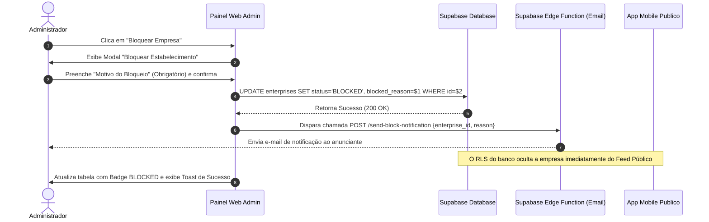

# Especificação Técnica: Painel Admin - Gestão de Empresas (Divulgação Comercial)
**Módulo:** Divulgação de Empresas / Lojas (Sprint 15)  
**Arquivo:** `02_admin_stores_tab.md`

---

## 1. Visão Geral da Interface

A aba **Gestão de Empresas e Moderação** é uma ferramenta exclusiva do Backoffice Web (acessível apenas por usuários com a role `admin` ou `service_role`). Seu objetivo é permitir o monitoramento dos estabelecimentos comerciais cadastrados na plataforma, auditoria técnica, atendimento de SAC e moderação de conteúdo (bloqueio por infração aos termos de uso ou conteúdos inadequados).

> [!NOTE]
> A nomenclatura das tabelas foi atualizada de `stores` para **`enterprises`** para evitar ambiguidades com o módulo de `stories`.

### Wireframe / Layout Conceitual

```
+----------------------------------------------------------------------------------------------------+
| PAINEL ADMINISTRATIVO > GESTÃO DE EMPRESAS                                                         |
+----------------------------------------------------------------------------------------------------+
| [ 🔍 Buscar por Nome, Email ou CNPJ... ]  [ Status: Todos ▾ ]  [ Plano: Todos ▾ ]  [ Cidade ▾ ]    |
+----------------------------------------------------------------------------------------------------+
| ID     | Proprietário         | Nome Fantasia  | Plano   | Endereços | Status    | Validade | Ações|
|--------|----------------------|----------------|---------|-----------|-----------|----------|------|
| #1029  | carlos@empresa.com   | Padaria Central| PREMIUM | 3 filiais | ACTIVE    | 12/2027  | [👁][🚫]|
| #1030  | maria@loja.com       | Boutique Flor  | LITE    | 1 filial  | PENDING   | -        | [👁][🚫]|
| #1031  | joao@servicos.com    | Oficina Silva  | PREMIUM | 1 filial  | BLOCKED   | -        | [👁][🔓]|
+----------------------------------------------------------------------------------------------------+
| Paginação: < 1 2 3 4 5 >                                                     Exibindo 1-10 de 142  |
+----------------------------------------------------------------------------------------------------+
```

---

## 2. Componentes da Interface

### 2.1 Barra de Filtros e Busca
* **Input de Busca Global:** Filtro em tempo real (com `debounce` de 300ms) que consulta por `nome_fantasia`, `razao_social`, `cnpj` ou e-mail do proprietário (`auth.users.email`).
* **Dropdown de Status:** Opções: `Todos`, `Ativa (ACTIVE)`, `Aguardando Pagamento (PENDING_PAYMENT)`, `Rascunho (DRAFT)`, `Expirada (EXPIRED)`, `Bloqueada (BLOCKED)`.
* **Dropdown de Plano (Tier):** Opções: `Todos`, `Lite`, `Premium`.
* **Seletor de Estado/Cidade:** Permite filtrar estabelecimentos por localização geográfica das filiais.

---

### 2.2 Tabela de Gestão de Empresas

#### Colunas da Tabela

| Coluna | Campo Origem | Renderização / Formatação |
| :--- | :--- | :--- |
| **ID** | `enterprises.id` | Hash truncado (ex: `#a1b2...c3d4`) com tooltip para cópia do UUID completo |
| **Proprietário** | `auth.users.email` | Nome e E-mail do usuário obtido via join ou função admin Supabase |
| **Nome Fantasia** | `enterprises.nome_fantasia` | Texto em destaque com logotipo miniatura ao lado (se disponível) |
| **Plano (Tier)** | `enterprises.tier` | Badge semântica: <br>• `PREMIUM`: Fundo Dourado/Roxo com ícone de Estrela <br>• `LITE`: Fundo Azul/Cinza |
| **Endereços** | `enterprise_addresses` | Contagem de filiais vinculadas (ex: `"3 filiais"`) |
| **Status** | `enterprises.status` | Badge com tag de cor: <br>• `ACTIVE`: Verde <br>• `PENDING_PAYMENT`: Amarelo <br>• `EXPIRED`: Vermelho <br>• `BLOCKED`: Preto/Vermelho Escuro <br>• `DRAFT`: Cinza |
| **Validade** | `enterprise_subscriptions.expires_at` | Data formatada `DD/MM/AAAA` (ou `"-"` se não estiver ativa) |
| **Ações** | N/A | Botões de ação rápida: Detalhes `[👁]`, Bloquear `[🚫]` / Desbloquear `[🔓]`, Histórico `[📜]` |

---

## 3. Moderação e Ciclo de Bloqueio / Desbloqueio

### 3.1 Fluxo de Bloqueio de Empresa

Ao clicar no botão de Bloquear `[🚫]` em uma empresa com status `ACTIVE`, `PENDING_PAYMENT` ou `DRAFT`:



#### Regras do Modal de Bloqueio:
* **Campo `blocked_reason`:** `textarea` obrigatório com limite mínimo de 10 caracteres e máximo de 500 caracteres.
* **Confirmação:** Botão em destaque vermelho: `"Confirmar Bloqueio"`.

---

### 3.2 Fluxo de Desbloqueio de Empresa

Ao clicar no botão de Desbloquear `[🔓]` em um registro no estado `BLOCKED`:

1. Exibe modal de confirmação: *"Deseja reativar o anúncio do estabelecimento [Nome Fantasia]?"*.
2. O sistema avalia a assinatura mais recente em `enterprise_subscriptions`:
   * Se houver assinatura com `expires_at > NOW()`, o status é restaurado para `'ACTIVE'`.
   * Se a assinatura estiver vencida, o status é ajustado para `'EXPIRED'`.
   * Se não houver pagamento prévio, o status retorna para `'PENDING_PAYMENT'` ou `'DRAFT'`.
3. O campo `blocked_reason` é limpo (`NULL`).

---

## 4. Modal de Detalhes e Auditoria (Visualização de Suporte)

Ao clicar no botão de Detalhes `[👁]`, abre-se uma gaveta lateral ou modal expansível com as seguintes seções:

### 4.1 Dados Cadastrais e Mídia
* Logo e Banner horizontal (com opção de visualizar imagem em tamanho real).
* Razão Social, CNPJ, Categoria, Descrição Completa.
* Links de contato: WhatsApp, Instagram, Website.

### 4.2 Filiais e Endereços Cadastrados
* Tabela de endereços cadastrados em `enterprise_addresses` com Logradouro, Cidade, Estado, CEP e coordenadas (Lat/Lng).

### 4.3 Histórico de Assinaturas e Pagamentos Stripe
* Histórico de transações vinculadas (`enterprise_subscriptions`):
  * **ID da Transação Stripe (`stripe_intent_id`)**
  * **Valor Pago** (convertido de centavos para R$)
  * **Data de Início e Expiração**
  * **Status do Gateway** (`succeeded`, `pending`, `failed`)
  * **Breakdown de Cobrança** (JSON discriminando o valor bruto do plano base, adicionais por cidade e desconto concedido por cidades distintas).

---

## 5. Implementação Técnica (Queries e API Supabase)

### 5.1 Query Principal da Tabela de Empresas (Com Paginação e Join)

```typescript
// Exemplo em TypeScript usando o Supabase JS Client
export async function getAdminEnterprises({
  page = 1,
  pageSize = 10,
  search = '',
  status = null,
  tier = null,
}: GetAdminEnterprisesParams) {
  const from = (page - 1) * pageSize;
  const to = from + pageSize - 1;

  let query = supabase
    .from('enterprises')
    .select(`
      id,
      user_id,
      nome_fantasia,
      razao_social,
      cnpj,
      tier,
      status,
      blocked_reason,
      created_at,
      enterprise_addresses (id, city, state),
      enterprise_subscriptions (expires_at, status, amount_paid)
    `, { count: 'exact' });

  // Aplicar Filtro de Busca por Texto
  if (search) {
    query = query.or(`nome_fantasia.ilike.%${search}%,razao_social.ilike.%${search}%,cnpj.ilike.%${search}%`);
  }

  // Filtros de Enum
  if (status) query = query.eq('status', status);
  if (tier) query = query.eq('tier', tier);

  // Paginação e Ordenação
  const { data, count, error } = await query
    .order('created_at', { ascending: false })
    .range(from, to);

  if (error) throw error;
  return { enterprises: data, totalCount: count };
}
```

### 5.2 Execução da Ação de Bloqueio (Admin Update)

```typescript
export async function blockEnterprise(enterpriseId: string, reason: string) {
  const { data, error } = await supabase
    .from('enterprises')
    .update({
      status: 'BLOCKED',
      blocked_reason: reason,
      updated_at: new Date().toISOString()
    })
    .eq('id', enterpriseId)
    .select()
    .single();

  if (error) throw error;

  // Invocar Edge Function para Notificação via E-mail
  await supabase.functions.invoke('send-enterprise-blocked-email', {
    body: { enterpriseId, reason, ownerUserId: data.user_id }
  });

  return data;
}
```

