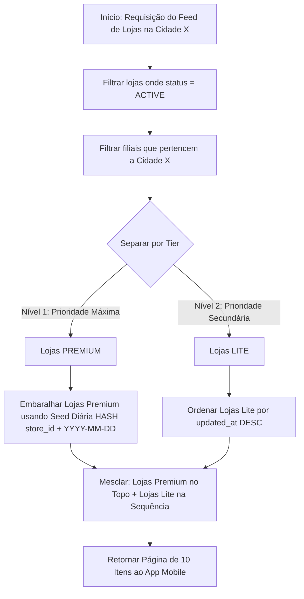

# Especificação Técnica: App Mobile - Feed de Lojas e Tela de Detalhes
**Módulo:** Divulgação de Lojas (Sprint 15)  
**Arquivo:** `04_app_feed_screen.md`

---

## 1. Visão Geral das Telas Públicas

As telas públicas do Módulo de Lojas formam a vitrine comercial no aplicativo mobile (desenvolvido em React Native). Seu objetivo principal é fornecer uma busca geolocalizada extremamente rápida para o consumidor e maximizar a taxa de conversão (chamadas no WhatsApp, ligações e visitas físicas) para os lojistas assinantes.

---

## 2. Tela Principal: Feed de Lojas

O Feed é a tela inicial do módulo de divulgação. Ele lista os estabelecimentos ativos na cidade selecionada.

### Layout e Componentes do Feed

```
+-------------------------------------------------------------------+
| 📍 Cidade: São Paulo - SP [ Alterar ▾ ]                           |
| 🔍 [ Buscar por nome da loja...                                 ] |
+-------------------------------------------------------------------+
|                                                                   |
| +---------------------------------------------------------------+ |
| | ⭐ DESTAQUE PREMIUM                                           | |
| | [============ BANNER ILUSTRATIVO DA LOJA ===================] | |
| | (LOGO) Padaria Real Central                                   | |
| | 🍔 Alimentação & Padaria • Centro (1.2 km)                    | |
| +---------------------------------------------------------------+ |
|                                                                   |
| +---------------------------------------------------------------+ |
| | (LOGO) Boutique Flor de Lis                                   | |
| | 👗 Moda Feminina • Pinheiros (3.4 km)                         | |
| +---------------------------------------------------------------+ |
|                                                                   |
+-------------------------------------------------------------------+
```

---

### 2.1 Topo: Busca e Seleção de Localização
* **Seletor de Cidade Geoprompt:**
  * Por padrão, ao abrir a tela, o aplicativo consulta as coordenadas GPS do dispositivo via SDK de localização.
  * O backend faz o *Reverse Geocoding* para identificar a cidade atual (ex: `"São Paulo"`).
  * O usuário pode clicar no seletor da Top Bar para abrir um modal de seleção manual de cidade.
* **Barra de Busca por Texto Livre:**
  * Input de busca por `nome_fantasia` ou `category`.
  * Filtra a lista com `debounce` de 300ms.

---

### 2.2 Algoritmo de Priorização, Ordenação e Rotatividade Diária

A listagem do Feed utiliza **paginação por scroll infinito** (10 lojas por requisição) para garantir carregamento instantâneo no mobile.

#### Regras de Ordenação do Feed:



1. **Prioridade Absoluta por Tier:** Lojas `PREMIUM` da cidade selecionada obrigatoriamente aparecem acima de qualquer loja `LITE`.
2. **Rotatividade Justa entre Premium (Seed Diária):** Para evitar que a primeira loja Premium cadastrada fique permanentemente no topo da lista, a ordenação secundária do plano Premium aplica um algoritmo de ordenação pseudo-aleatória baseado em **seed diária** (`YYYY-MM-DD`). 
   * Com isso, a ordem de exibição entre as lojas Premium altera a cada meia-noite, garantindo equidade de impressões para todos os assinantes Premium.
3. **Ordenação Secundária Lite:** As lojas do plano `LITE` são ordenadas pela data de atualização (`updated_at DESC`).

---

### 2.3 Diferenciação Visual dos Cards de Loja

#### Card Premium (`tier = 'PREMIUM'`)
* **Moldura:** Borda em destaque com gradiente visual e elevação de sombra (box-shadow).
* **Badge:** Selo *"⭐ Destaque Premium"* sobreposto no canto superior direito.
* **Imagem de Capa/Banner:** Exibição de imagem promocional horizontal (`banner_url`, proporção 16:9) no topo do card.
* **Logotipo:** Imagem circular ou quadrada destacada sobre a capa.
* **Informações:** Nome Fantasia (fonte em negrito), Categoria, Bairro/Distância estimada a partir do GPS do usuário.

#### Card Lite (`tier = 'LITE'`)
* **Formato:** Compacto horizontal ou vertical minimalista sem imagem de banner.
* **Informações:** Logotipo da marca, Nome Fantasia, Categoria e Bairro.

---

## 3. Tela de Detalhes da Loja (Vitrine de Conversão)

Ao clicar em qualquer card no Feed, o aplicativo navega para a **Tela de Detalhes da Loja**. Esta tela funciona como um "mini-site" do estabelecimento comercial e foi projetada estritamente para conversão de vendas.

### Layout da Vitrine de Conversão

```
+-------------------------------------------------------------------+
| < Voltar                                           [ 🔗 Compartilhar ]|
| +---------------------------------------------------------------+ |
| |                                                               | |
| |               [ BANNER DE CAPA PROMOCIONAL ]                  | |
| |                                                               | |
| +---------------------------------------------------------------+ |
| ( LOGO )  Padaria Real Central ⭐ Premium                         | |
| 🍔 Alimentação & Padaria                                          | |
|                                                                   | |
| [ 💬 WhatsApp ] [ 📞 Ligar ] [ 🌐 Instagram/Site ] [ 📍 Filiais ] | |
|                                                                   | |
| 📋 SOBRE O ESTABELECIMENTO                                        | |
| A melhor padaria artesanal da região com pães frescos a toda hora.| |
|                                                                   | |
| 📍 ENDEREÇOS E FILIAIS (2)                                        | |
| 1. Av. Paulista, 1000 - Bela Vista, São Paulo - SP                | |
|    [ 🗺️ Abrir no Mapa (Google Maps / Waze) ]                      | |
| 2. Rua Augusta, 500 - Consolação, São Paulo - SP                  | |
|    [ 🗺️ Abrir no Mapa (Google Maps / Waze) ]                      | |
+-------------------------------------------------------------------+
```

---

### 3.1 Barra de Ações Rápidas (Botoes de Conversão)

Localizados em posição de alto destaque abaixo do cabeçalho da loja:

1. **Botão WhatsApp `[ 💬 WhatsApp ]`:**
   * Abre o WhatsApp nativo através de Deeplink oficial.
   * Formato da URI: `https://wa.me/5511999998888?text=Ol%C3%A1!%20Vi%20sua%20loja%20no%20App%20SIGA.`
2. **Botão Ligar `[ 📞 Ligar ]`:**
   * Aciona o discador nativo do sistema operacional.
   * Formato da URI: `tel:11999998888` via `Linking.openURL()`.
3. **Botão Instagram / Website `[ 🌐 Instagram ]`:**
   * Tenta abrir no aplicativo do Instagram via Deeplink: `instagram://user?username=nomedaloja`.
   * Caso o app não esteja instalado, faz fallback para abertura no navegador interno da aplicação (`WebView`).
4. **Botão Compartilhar Organicamente `[ 🔗 Compartilhar ]`:**
   * Aciona o *Share Sheet* nativo do dispositivo (iOS / Android) enviando a URL do perfil orgânico da loja e mensagem promocional.

---

### 3.2 Listagem de Endereços e Integração com Mapas

Exibe a lista de todas as filiais físicas vinculadas em `store_addresses`.

* Cada endereço lista o logradouro completo formatado (`formatted_address`).
* **Ação "Abrir no Mapa":** Ao clicar no botão, o app abre um `ActionSheet` nativo para o usuário escolher seu aplicativo de navegação favorito:
  * **Google Maps:** `https://www.google.com/maps/search/?api=1&query={lat},{lng}`
  * **Waze:** `https://waze.com/ul?ll={lat},{lng}&navigate=yes`
  * **Apple Maps (iOS):** `http://maps.apple.com/?daddr={lat},{lng}`

---

## 4. Implementação Técnica em React Native & Supabase

### 4.1 Query RPC / SQL para Paginação do Feed com Seed Diária

```sql
-- Função Postgres no Supabase para buscar Feed ordenado por seed diária
CREATE OR REPLACE FUNCTION get_public_enterprise_feed(
  search_city TEXT,
  search_text TEXT DEFAULT '',
  page_offset INT DEFAULT 0,
  page_limit INT DEFAULT 10,
  seed_date TEXT DEFAULT TO_CHAR(NOW(), 'YYYY-MM-DD')
)
RETURNS TABLE (
  id UUID,
  nome_fantasia TEXT,
  category TEXT,
  tier enterprise_tier,
  logo_url TEXT,
  banner_url TEXT,
  description TEXT,
  whatsapp TEXT,
  addresses JSONB
) AS $$
BEGIN
  RETURN QUERY
  SELECT 
    e.id,
    e.nome_fantasia,
    e.category,
    e.tier,
    e.logo_url,
    e.banner_url,
    e.description,
    e.whatsapp,
    jsonb_agg(jsonb_build_object(
      'id', ea.id,
      'city', ea.city,
      'state', ea.state,
      'formatted_address', ea.formatted_address,
      'lat', ea.lat,
      'lng', ea.lng
    )) AS addresses
  FROM enterprises e
  INNER JOIN enterprise_addresses ea ON ea.enterprise_id = e.id
  WHERE e.status = 'ACTIVE'
    AND LOWER(ea.city) = LOWER(search_city)
    AND (search_text = '' OR e.nome_fantasia ILIKE '%' || search_text || '%' OR e.category ILIKE '%' || search_text || '%')
  GROUP BY e.id
  ORDER BY 
    -- 1. Prioridade para Premium
    CASE WHEN e.tier = 'PREMIUM' THEN 0 ELSE 1 END ASC,
    -- 2. Ordenação por Seed Diária entre Premium
    md5(e.id::text || seed_date) DESC,
    -- 3. Data de Atualização entre Lite
    e.updated_at DESC
  OFFSET page_offset
  LIMIT page_limit;
END;
$$ LANGUAGE plpgsql STABLE;
```

### 4.2 Componente React Native de Ações Rápidas (Conversão)

```typescript
import React from 'react';
import { View, TouchableOpacity, Text, Linking, Share, StyleSheet } from 'react-native';

interface QuickActionsProps {
  phone?: string;
  whatsapp?: string;
  instagram?: string;
  storeName: string;
}

export const StoreQuickActions: React.FC<QuickActionsProps> = ({
  phone,
  whatsapp,
  instagram,
  storeName,
}) => {
  const handleWhatsApp = () => {
    if (!whatsapp) return;
    const cleanNumber = whatsapp.replace(/\D/g, '');
    const msg = encodeURIComponent(`Olá! Encontrei a ${storeName} no App SIGA.`);
    Linking.openURL(`https://wa.me/${cleanNumber}?text=${msg}`);
  };

  const handleCall = () => {
    if (!phone) return;
    const cleanNumber = phone.replace(/\D/g, '');
    Linking.openURL(`tel:${cleanNumber}`);
  };

  const handleShare = async () => {
    await Share.share({
      message: `Confira a loja ${storeName} no aplicativo SIGA!`,
    });
  };

  return (
    <View style={styles.container}>
      {whatsapp && (
        <TouchableOpacity style={[styles.btn, styles.waBtn]} onPress={handleWhatsApp}>
          <Text style={styles.btnText}>💬 WhatsApp</Text>
        </TouchableOpacity>
      )}
      {phone && (
        <TouchableOpacity style={[styles.btn, styles.callBtn]} onPress={handleCall}>
          <Text style={styles.btnText}>📞 Ligar</Text>
        </TouchableOpacity>
      )}
      <TouchableOpacity style={[styles.btn, styles.shareBtn]} onPress={handleShare}>
        <Text style={styles.btnText}>🔗 Compartilhar</Text>
      </TouchableOpacity>
    </View>
  );
};

const styles = StyleSheet.StyleSheet.create({
  container: { flexDirection: 'row', justifyContent: 'space-around', marginVertical: 12 },
  btn: { paddingVertical: 10, paddingHorizontal: 16, borderRadius: 8 },
  waBtn: { backgroundColor: '#25D366' },
  callBtn: { backgroundColor: '#007AFF' },
  shareBtn: { backgroundColor: '#8E8E93' },
  btnText: { color: '#FFF', fontWeight: 'bold' },
});
```
