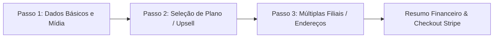
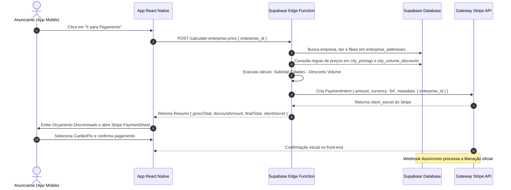

# Especificação Técnica: App Mobile - Gestão do Anunciante e Checkout
**Módulo:** Divulgação de Empresas / Lojas (Sprint 15)  
**Arquivo:** `05_app_my_stores_screen.md`

---

## 1. Visão Geral do Painel do Anunciante

A área restrita do anunciante no aplicativo permite que comerciantes cadastrem seus estabelecimentos (`enterprises`), escolham planos de anúncio (Lite ou Premium), gerenciem múltiplas filiais por geolocalização (`enterprise_addresses`) e efetuem o pagamento anual da assinatura via Stripe / Pix.

---

## 2. Tela 1: Meus Anúncios / Minhas Empresas

Dashboard administrativo onde o usuário visualiza e opera todas as suas empresas cadastradas (`user_id == auth.uid()`).

```
+-------------------------------------------------------------------+
| 🏪 PAINEL DO ANUNCIANTE: MINHAS EMPRESAS             [ + Criar ]  |
+-------------------------------------------------------------------+
|                                                                   |
| +---------------------------------------------------------------+ |
| | Padaria Real Central                           🟢 ATIVA       | |
| | Plano: PREMIUM • 3 Filiais                     Válido até:    | |
| |                                                15/08/2027     | |
| | [ ✏️ Editar Dados ] [ 📍 Gerenciar Filiais ]                  | |
| +---------------------------------------------------------------+ |
|                                                                   |
| +---------------------------------------------------------------+ |
| | Oficina Mecânica Silva                         🟡 AGUARDANDO | |
| | Plano: LITE • 1 Filial                         PAGAMENTO      | |
| |                                                               | |
| | [ 💳 Concluir Pagamento (R$ 99,00) ]                           | |
| +---------------------------------------------------------------+ |
|                                                                   |
| +---------------------------------------------------------------+ |
| | Sorveteria Verão                               🔴 EXPIRADA    | |
| | Plano: LITE • 1 Filial                         Venceu em:     | |
| |                                                01/08/2026     | |
| | [ 🔄 Renovar Assinatura Anual ]                                | |
| +---------------------------------------------------------------+ |
|                                                                   |
| +---------------------------------------------------------------+ |
| | Empresa X                                      ⬛ BLOQUEADA   | |
| | Motivo: Infração de Termos de Uso (Imagem Inadequada)         | |
| | [ 💬 Falar com o Suporte / SAC ]                              | |
| +---------------------------------------------------------------+ |
+-------------------------------------------------------------------+
```

---

### 2.1 Mapeamento de Status e Ações Disponíveis

| Status (`enterprises.status`) | Cor do Badge | Significado / Regra de Negócio | Ações do Usuário no Card |
| :--- | :--- | :--- | :--- |
| `ACTIVE` | 🟢 Verde | Assinatura paga e válida. Exibe a data limite (`expires_at`). | • Editar Informações <br>• Gerenciar Filiais <br>• Alterar Tier (Upgrade) |
| `PENDING_PAYMENT` | 🟡 Amarelo | Formulário concluído. Checkout pendente de liquidação. | • Botão em destaque: **"Concluir Pagamento"** |
| `EXPIRED` | 🔴 Vermelho | Período de 365 dias esgotado. Anúncio oculto do Feed. | • Botão em destaque: **"Renovar Assinatura"** |
| `BLOCKED` | ⬛ Escuro | Bloqueada pela equipe de moderação. Oculta do Feed. | • Exibe caixa com `blocked_reason` <br>• Botão **"Contatar Suporte SAC"** |
| `DRAFT` | ⚪ Cinza | Cadastro salvo como rascunho incompleto. | • Botão **"Continuar Cadastro"** |

---

## 3. Tela 2: Wizard de Cadastro / Edição de Empresa

Formulário guiado em 3 passos simples para criação e edição de empresas.



### 3.1 Passo 1: Dados Básicos e Upload de Mídias
* **Campos Obrigatórios:** Nome Fantasia*, Categoria*.
* **Campos Opcionais:** Razão Social, CNPJ, WhatsApp (DDD + Número), Instagram (@username), Website, Descrição Institucional.
* **Upload de Logotipo e Banner:**
  * **Logo:** Formato quadrado/circular (`1:1`).
  * **Banner:** Formato horizontal (`16:9`, necessário para plano Premium).
  * **Otimização Client-Side:** O app comprime a imagem para WebP/JPEG antes do upload enviando para o Supabase Storage (`bucket: 'enterprises'`).

---

### 3.2 Passo 2: Seleção do Plano Anual (Upsell Interativo)
Card comparativo expansível evidenciando os benefícios do plano Premium:

| Funcionalidade | Plano Lite | Plano Premium ⭐ |
| :--- | :---: | :---: |
| **Exibição no Feed Público** | Sim | Sim |
| **Posicionamento no Topo do Feed** | Não (Abaixo dos Premium) | **Sim (Prioridade Absoluta)** |
| **Destaque Visual no Card** | Formato Compacto | **Borda Gradiente + Selo Premium** |
| **Banner de Capa Promocional** | Não | **Sim (Banner Horizontal 16:9)** |
| **Rotatividade Diária Justa** | Não | **Sim (Algoritmo de Seed Diária)** |

---

### 3.3 Passo 3: Gestão de Endereços (Filiais)
* Exibe a lista de endereços físicos cadastrados para este estabelecimento.
* Botão `[ + Adicionar Endereço ]` que abre o **Modal de Endereço Inteligente**.
* **Validação de Bloqueio:** O usuário é impedido de avançar para a etapa de pagamento caso a empresa não possua **pelo menos 1 (um) endereço cadastrado**.

---

## 4. Tela 3: Modal de Endereço Inteligente (Geocoding)

Para garantir precisão nos dados de geolocalização e evitar digitação livre propensa a erros, o endereço é capturado através do SDK do Google Places / Geocoding API.

```
+-------------------------------------------------------------------+
| MODAL: ADICIONAR ENDEREÇO                                     [X] |
+-------------------------------------------------------------------+
| 🔍 Digite o endereço ou CEP:                                      |
| [ Av. Paulista, 1000                                            ] |
|                                                                   |
| SUGESTÕES AUTOCOMPLETE:                                           |
| 📍 Av. Paulista, 1000 - Bela Vista, São Paulo - SP                |
| 📍 Av. Paulista, 1000 - Jardim Primavera, Ribeirão Preto - SP     |
+-------------------------------------------------------------------+
| DADOS CONFIRMADOS:                                                |
| Logradouro: Av. Paulista, 1000                                    |
| Bairro: Bela Vista | Cidade: São Paulo | Estado: SP               |
| CEP: 01310-100 | Coordenadas: Lat -23.5615, Lng -46.6559          |
|                                                                   |
| [ Confirmar e Salvar Filial ]                                     |
+-------------------------------------------------------------------+
```

### Dados Salvos em `enterprise_addresses`:
* `formatted_address`: `"Av. Paulista, 1000 - Bela Vista, São Paulo - SP"`
* `city`: `"São Paulo"` (Normalizado)
* `state`: `"SP"`
* `neighborhood`: `"Bela Vista"`
* `zip_code`: `"01310-100"`
* `lat`: `-23.5615` | `lng`: `-46.6559`
* `place_id`: `"ChIJn1t..."`

---

## 5. Tela 4: Resumo Financeiro, Orçamento e Checkout Stripe

### 5.1 Regra de Segurança Anti-Fraude de Preços
> [!IMPORTANT]
> O aplicativo móvel **NUNCA** calcula ou envia o valor da cobrança em dinheiro para a API de Pagamentos. O app mobile envia apenas o `enterprise_id`. O Backend calcula o valor server-side consultando a tabela `city_pricings` e `city_volume_discounts` e gera o token oficial do Stripe (*PaymentIntent*).

---

### 5.2 Fluxo de Orçamento e Pagamento



---

### 5.3 Webhook Assíncrono do Stripe (`payment_intent.succeeded`)

1. O Stripe dispara o evento `payment_intent.succeeded` para a Edge Function `/stripe-webhook`.
2. A Edge Function extrai o `enterprise_id` do campo `metadata`.
3. Executa a atualização na tabela `enterprises`:
   * `status` = `'ACTIVE'`
   * `updated_at` = `NOW()`
4. Insere um registro na tabela `enterprise_subscriptions`:
   * `starts_at` = `NOW()`
   * `expires_at` = `NOW() + INTERVAL '1 year'` (365 dias de vigência)
   * `status` = `'succeeded'`
   * `amount_paid` = valor recebido em centavos
5. O anunciante recebe uma notificação Push/E-mail informando que seu anúncio está ativo no Feed público.

---

## 6. Implementação Técnica em React Native & Stripe SDK

### 6.1 Integração do Stripe PaymentSheet no React Native

```typescript
import React, { useState } from 'react';
import { View, Text, TouchableOpacity, Alert, ActivityIndicator } from 'react-native';
import { useStripe } from '@stripe/stripe-react-native';
import { supabase } from '../lib/supabase';

interface CheckoutProps {
  enterpriseId: string;
  onPaymentSuccess: () => void;
}

export const EnterpriseCheckoutScreen: React.FC<CheckoutProps> = ({ enterpriseId, onPaymentSuccess }) => {
  const { initPaymentSheet, presentPaymentSheet } = useStripe();
  const [loading, setLoading] = useState(false);
  const [breakdown, setBreakdown] = useState<any>(null);

  // 1. Solicitar Orçamento Server-Side e Inicializar PaymentSheet
  const fetchPaymentSheetParams = async () => {
    setLoading(true);
    try {
      const { data, error } = await supabase.functions.invoke('calculate-enterprise-price', {
        body: { enterpriseId },
      });

      if (error || !data) throw new Error('Falha ao calcular orçamento da empresa');

      setBreakdown(data.breakdown);

      // Inicializar PaymentSheet com o clientSecret retornado do Stripe
      const { error: stripeError } = await initPaymentSheet({
        paymentIntentClientSecret: data.clientSecret,
        merchantDisplayName: 'SIGA Módulo de Divulgação Comercial',
        defaultBillingDetails: { name: 'Anunciante SIGA' },
      });

      if (stripeError) Alert.alert('Erro Stripe', stripeError.message);
    } catch (err: any) {
      Alert.alert('Erro', err.message);
    } finally {
      setLoading(false);
    }
  };

  // 2. Apresentar Modal do Stripe para Pagamento
  const openCheckout = async () => {
    const { error } = await presentPaymentSheet();

    if (error) {
      Alert.alert('Pagamento não concluído', error.message);
    } else {
      Alert.alert('Sucesso!', 'Seu pagamento foi recebido e seu anúncio será ativado em instantes.');
      onPaymentSuccess();
    }
  };

  return (
    <View style={{ padding: 16 }}>
      <Text style={{ fontSize: 18, fontWeight: 'bold', marginBottom: 12 }}>Resumo da Assinatura</Text>

      {breakdown && (
        <View style={{ backgroundColor: '#F2F2F7', padding: 12, borderRadius: 8, marginBottom: 16 }}>
          <Text style={{ fontWeight: '600' }}>Plano: {breakdown.tier}</Text>
          <Text>Subtotal Bruto: R$ {(breakdown.grossTotalCentavos / 100).toFixed(2)}</Text>
          <Text>Cidades Distintas: {breakdown.distinctCitiesCount}</Text>
          {breakdown.discountPercentage > 0 && (
            <Text style={{ color: '#34C759', fontWeight: '600' }}>
              Desconto Cidades Distintas ({breakdown.discountPercentage}% OFF): -R$ {(breakdown.discountAmountCentavos / 100).toFixed(2)}
            </Text>
          )}
          <Text style={{ fontSize: 16, fontWeight: 'bold', marginTop: 8, color: '#007AFF' }}>
            Total Anual: R$ {(breakdown.finalTotalCentavos / 100).toFixed(2)}
          </Text>
          <Text style={{ fontSize: 11, color: '#666', marginTop: 4 }}>
            Seu anúncio ficará disponível publicamente por 365 dias.
          </Text>
        </View>
      )}

      {!breakdown ? (
        <TouchableOpacity
          style={{ backgroundColor: '#007AFF', padding: 14, borderRadius: 8, alignItems: 'center' }}
          onPress={fetchPaymentSheetParams}
          disabled={loading}
        >
          {loading ? <ActivityIndicator color="#FFF" /> : <Text style={{ color: '#FFF', fontWeight: 'bold' }}>Gerar Orçamento</Text>}
        </TouchableOpacity>
      ) : (
        <TouchableOpacity
          style={{ backgroundColor: '#34C759', padding: 14, borderRadius: 8, alignItems: 'center' }}
          onPress={openCheckout}
        >
          <Text style={{ color: '#FFF', fontWeight: 'bold' }}>Pagar Agora com Stripe / Pix</Text>
        </TouchableOpacity>
      )}
    </View>
  );
};
```